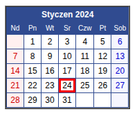

# Legacy
Первое задание

Перед Вами программа которая формирует в формате **HTML** календарь на текущий месяц. 
Получен следующий вариант:

|      |
|------|
|
|      |

Заказчик просит внести изменения.

> К сожалению, разработчик, которому ранее было поручено создать данный календарь не завершил работу.
> Увы, он сильно заболел и не доступен для консультаций. 
> По мнению менеджмента, для Вас не должно составить никаких проблем. 

Вам необходимо:
- Дописать программу. Сделать выгрузку календаря в формат HTML, в файл. Наименование файла должен определять Заказчик (произвольное), но расширение - строго HTML
- Сделать календарь на русском языке по умолчанию. Так же, добавить разные языки: английский, немецкий. В перспективе, язык должен настраиваться.
- Календарь должен отображаться в зависимости от языка. Если русский, то начинаться с понедельника, если западный язык, то с воскресенья, как сейчас.
- Суббота и воскресенье должны отмечаться одним цветом. Фон светло красный, а цвет текста - ярко красный. Праздник (23 фебраля, 8-е марта и прочее) должен отображаться синим цветом и светло синим фоном.
Календарь должен формироваться за любой указанный месяц Заказчиком.

[Вот файл с программой который передал нам коллега](main.py)  
**Удачи, бро!**

